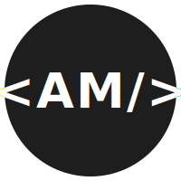

# Portfolio

Frontend interactivo que muestra proyectos y experiencia profesional. Datos cargados desde API REST (Spring Boot), con interfaz de terminal Linux y soporte multiidioma.

**Stack Frontend:** Angular 19 · TypeScript · Tailwind · Transloco · Signals

---

## 🏗️ Arquitectura

```
┌─────────────────────┐
│  Angular (Vercel)   │  Frontend: tema oscuro (terminal), comandos interactivos
│  Signals · Tailwind │  Idiomas: ES/EN con Transloco
└──────────┬──────────┘
           │ HTTPS
           ↓
┌─────────────────────────────────┐
│  Spring Boot API (Render)       │  GET /api/proyectos?lang=es|en
│  - datos desde JSON embebidos   │  GET /api/experiencia?lang=...
│  - email con Resend             │  GET /api/formacion?lang=...
│  - keep-alive con @Scheduled    │  POST /api/contacto
└─────────────────────────────────┘
```

**Documentación completa de la API:** Ver [`GUIA-API.md`](./GUIA-API.md)

---

## 🚀 Características

- **Interfaz de terminal:** Comandos interactivos (`help`, `snake`, `sudo hire`)
- **Datos dinámicos:** Cargados desde API, no hardcodeados
- **Multiidioma:** Español e inglés, cambio en tiempo real
- **Tema claro/oscuro:** Toggle con persistencia en localStorage
- **Responsive:** Móvil, tablet, desktop
- **Accesible:** ARIA labels, navegación semántica

---

## 📖 Proyectos que muestra

La API sirve 4 proyectos principales:

1. **WoW Auction Analyzer** — Análisis de mercado + Discord Bot (Java, Spring Boot, Angular)
2. **Artesanos del Torno** — Web en producción con admin y e-commerce (PHP, Stripe)
3. **Ecosistema de librerías** — Suite reutilizable (Spring Boot + Angular, GitHub Packages)
4. **Portfolio** — Este mismo proyecto (Angular + Spring Boot)

Cada proyecto incluye: descripción, stack, características, caso de estudio (problema/aprendizajes), y enlaces a repositorios.

---

## 🔐 Permisos chmod de los proyectos

La lista de proyectos imita un `ls -l`: cada proyecto lleva un permiso octal (campo `permisos` en los JSON de datos, tanto en `public/i18n/*.json` como en la API `resources/datos/*.json`) con semántica propia:

| Permiso | Simbólico | Significado |
|---------|--------------|-------------|
| `755` | `drwxr-xr-x` | Proyecto público y desplegado (hay demo que visitar) |
| `750` | `drwxr-x---` | Proyecto profesional con parte privada |
| `700` | `drwx------` | Proyecto personal / laboratorio |
| `555` | `dr-xr-xr-x` | Solo lectura: terminado o sin mantenimiento |
| `777` | `drwxrwxrwx` | Experimental — "haz lo que quieras" (con humor; lo lleva este portfolio) |

**Cómo se usan:**
- El campo es opcional; si un proyecto no lo trae, el frontend asume `755`.
- La notación simbólica (`drwxr-xr-x`) se calcula en el frontend a partir del octal — no se guarda en los datos. En móvil solo se muestra el octal por espacio.
- Bajo la lista hay una leyenda `# chmod:` que se genera dinámicamente **solo con los códigos en uso** (los textos viven en `proyectos.leyenda` de los JSON de idioma, ya traducidos los 5).
- Al añadir un proyecto nuevo, basta con ponerle su `permisos` en los JSON: la columna y la leyenda se actualizan solas.

---

## 🛠️ Tecnologías Frontend

- **Framework:** Angular 19+
- **Lenguaje:** TypeScript 5.9+
- **Estilos:** Tailwind CSS
- **i18n:** Transloco (español/inglés)
- **Estado:** Signals y reactive forms
- **Bundler:** Vite
- **Deploy:** Vercel

---

## 🌐 Idiomas y temas

Soporta cambio dinámico de:
- **Idiomas:** Español (ES) e Inglés (EN)
- **Tema:** Oscuro (por defecto) y claro

Ambos se persisten en `localStorage` y se comunican a la API con `?lang=es|en`.

---

## 🎨 Diseño

Interfaz minimalista inspirada en terminal Linux:
- **Paleta:** Gris oscuro (#1e1e1e) + blanco + acentos turquesa (#06b6d4)
- **Tipografía:** Monoespaciada (JetBrains Mono para código)
- **Interactividad:** Comandos en la página de inicio, navegación oculta

---

## 🔌 Conexión con la API

El frontend consume:

- `GET /api/proyectos?lang=es` → Lista de 4 proyectos
- `GET /api/experiencia?lang=es` → Experiencia profesional
- `GET /api/formacion?lang=es` → Formación académica
- `POST /api/contacto` → Envío de emails

**Fallback local:** Si la API no responde, se usan los JSON de `public/i18n/` como datos estáticos.

**Variables de entorno:** `environment.ts` define `apiUrl` para dev (`http://localhost:8080`) y prod (Render).

---

## 📁 Estructura

```
portfolio/
├── public/
│   ├── logo.svg
│   ├── i18n/
│   │   ├── es.json  (Textos de UI + datos de proyectos)
│   │   └── en.json
│   └── proyectos/   (imágenes de proyectos)
├── src/
│   ├── app/
│   │   ├── components/       (Componentes reutilizables)
│   │   ├── pages/            (Vistas: inicio, proyectos, detalles, contacto)
│   │   ├── services/         (ProyectosService, ContactoService)
│   │   ├── models/           (interfaces de datos)
│   │   └── app.config.ts     (Transloco, HttpClient)
│   ├── styles/               (Tailwind, tema oscuro)
│   └── environments/
│       ├── environment.ts    (dev: http://localhost:8080)
│       └── environment.prod.ts (prod: Render)
├── angular.json
├── tailwind.config.ts
└── GUIA-API.md              (Documentación de la API asociada)
```

---

## 🚀 Cómo ejecutar

```bash
npm install
npm start
# → http://localhost:4200
```

**API de desarrollo:** Asegúrate de que Spring Boot corre en http://localhost:8080

---

## 📝 Notas

- Los datos de proyectos se definen en `public/i18n/*.json` y en la API (`resources/datos/es.json`)
- El cambio de idioma es instantáneo gracias a Transloco
- El tema se sincroniza con CSS custom properties en Tailwind
- La API está documentada en [`GUIA-API.md`](./GUIA-API.md)
